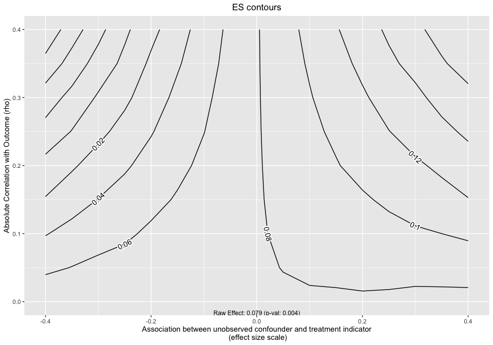
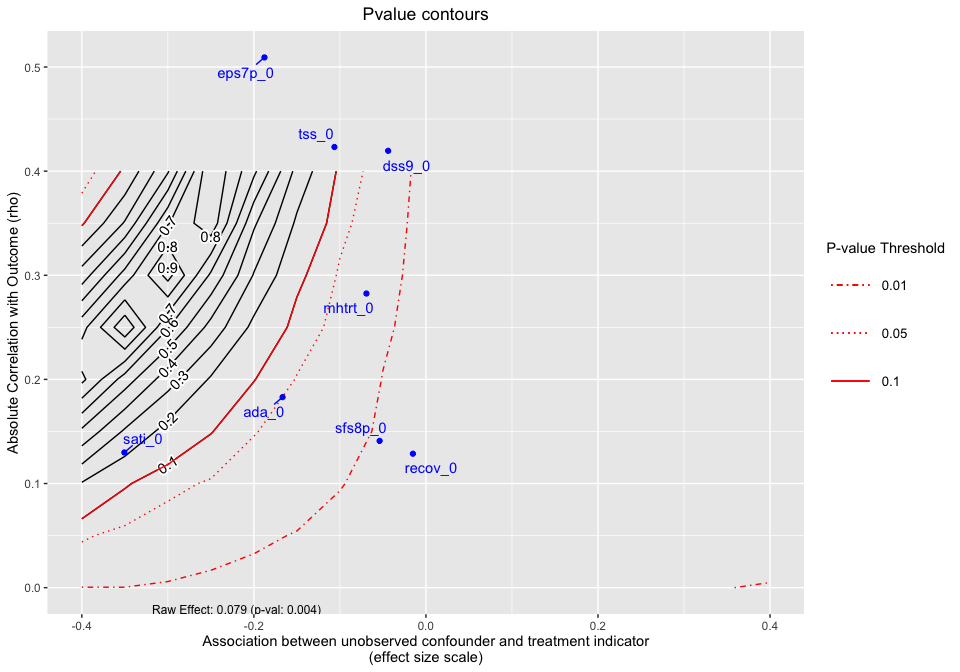
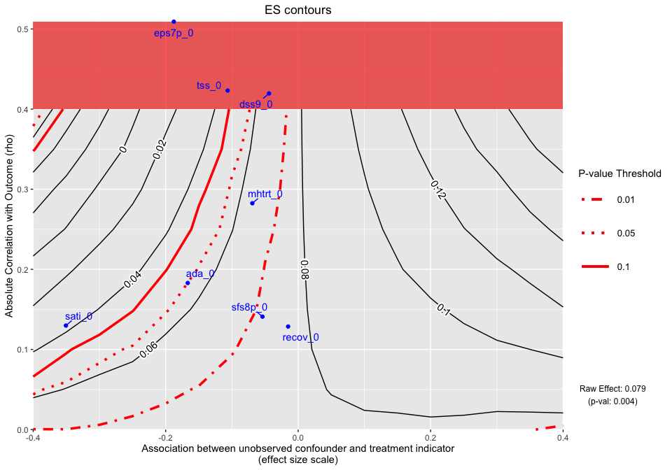

OVtool - Omitted Variable tool
================


*Note: This is a work in progress – last updated 04-10-2020*

# Introduction

The <ins>O</ins>mitted <ins>V</ins>ariable tool (`OVtool`) package was
designed to assess the sensitivity of research findings to omitted
variables when estimating causal effects using propensity score (PS)
weighting. This package includes graphics and summary results that will
enable a researcher to quantify the impact an omitted variable would
have on their results. Burgette et al. (in preparation) describe the
methodology behind the primary function in this package, `ov_simgrid()`.
This document presents syntax for the implementation of the
`ov_simgrid()` function and provides an example of how to interpret the
packages’ graphical output.

This package is useful in a wide range of applications where researchers
want to analyze how sensitive their research findings are to unobserved
confounders that were not included in their propensity score and outcome
models. It will estimate the potential impact of the unobserved
counfounders on both the estimated treatment or exposure effects as well
as on the statistical significance of an analysis.

# Example: Synthetic Data

This package is demonstrated using a random subset of the Global
Appraisal of Individual Needs biopsychosocial assessment instrument
(GAIN) (Dennis, Titus et al. 2003) from sites that adminstered two
different types of substance use disorder treatments (treatment “A” and
treatment “B”). The Center for Substance Abuse Treatment (CSAT) funded
the sites that administered these two SUD treatments. This dataset
consists of 4,000 adolescents. The main goal of this analysis is to
understand the effect Treatment A and Treatment B, indicated by `treat`,
have on mental health outcomes.

In this synthetic dataset, there are 2,000 adolescents in each treatment
group. Within this dataset there are variables on substance use disorder
and mental health outcomes. For this tutorial we are particularly
interested in the mental health outcome, `eps7p_3`, emotional problem
scale (eps) recorded at three months. Higher values of eps indicate more
emotional problems. Substance abuse researchers are particularly
interested in whether or not treatment A reduces emotional problems more
than treatment B. `eps7p_3` ranges from zero to one, where higher values
of EPS indicate more emotional problems. See (Dennis, 2003) for more
details on this scale.

Past research has indicated there are many influential confounders when
analyzing adolescents’ emotional problems, some included in this
synthetic dataset (cite CYT + our prior papers with MET/CBT5; get from
BA or main findings paper). These variables were measured at baseline:
emotional problem scale (`eps7p_0`), adjusted days abstinent (any in
past 90) (`ada_0`), substance frequency scale (`sfs8p_0`), substance
abuse treatment index (`sati_0`), in recovery (`recov_0`), traumatic
stress scale (`tss_0`), mental health treatment in the past 90 days
(`mhtrt_0`), and the depressive symptom scale (`dss9_0`). 

We begin by loading the development version of the package from
[GitHub](https://github.com/) with:

``` r
devtools::install_github("jpane24/OVtool")
library(OVtool)
set.seed(24)
```

We can load the synthetic dataset and print to screen the first six
observations by running the following two commands:

``` r
data(sud) 
# head(sud)
sud$treat = ifelse(sud$treat == "A", 1, 0)
```

The relevant variables in this analysis are:

  - **Treatment indicator** `treat`: indicates treatment type where 1 is
    Treatment “A” and 0 is Treatment “B”

  - **Outcome of interest** `eps7p_3`: emotional problem scale at
    3-months

  - `eps7p_0`: emotional problem scale at baseline

  - `sfs8p_0`: substance frequency scale 8-item version at baseline

  - `sati_0`: substance abuse treatment index at baseline

  - `ada_0`: adjusted days abstinent at baseline

  - `recov_0`: indicates whether the adolescent was in recovery at
    baseline, where 1 is in recovery and 0 is not in recovery

  - `tss_0`: traumatic stress scale at baseline

  - `mhtrt_0`: mental health treatment in the past 90 days at baseline

  - `dss9_0`: depressive symptom scale at baseline

In the next section, we will show how our method works with the average
treatment effect (ATE) using a continuous outcome. The OVtool also
handles binary outcomes and weights that were estimated using the
average treatment effect on the treated (ATT) estimand.

## Continous Outcome: Average Treatment Effect (ATE)

The `OVtool` can either take a vector of weights estimated using any
method or a ps object produced by `TWANG` (Ridgeway et al., 2014). We
begin walking through the OVtool by estimating weights using `ps()` from
the `TWANG` package prior to running our outcome model using
`OVtool::outcome_model()`. The snippet of code belows walks through an
example:

``` r
## Create Formula
my_formula = as.formula(treat ~ eps7p_0 + sfs8p_0 + sati_0 + ada_0 + recov_0 + 
                          tss_0 + mhtrt_0 + dss9_0)

## Get weights
sud = data.frame(sud)
ps.twang <- twang::ps(my_formula, data = sud, estimand = 'ATE', booster = "gbm",
                      stop.method = "ks.max", verbose=F, ks.exact = T)

# Check Balance
twang::bal.table(ps.twang); # summary(ps.twang)
```

    ## $unw
    ##          tx.mn  tx.sd  ct.mn  ct.sd std.eff.sz   stat     p    ks ks.pval
    ## eps7p_0  0.256  0.196  0.219  0.192      0.187  5.937 0.000 0.103   0.000
    ## sfs8p_0 11.253 13.134 10.571 12.162      0.054  1.703 0.089 0.045   0.032
    ## sati_0   8.233 22.128  2.145 10.658      0.345 11.088 0.000 0.121   0.000
    ## ada_0   48.748 33.400 54.236 32.454     -0.166 -5.271 0.000 0.081   0.000
    ## recov_0  0.246  0.431  0.240  0.427      0.015  0.479 0.632 0.006   1.000
    ## tss_0    2.277  3.525  1.924  3.115      0.106  3.365 0.001 0.043   0.050
    ## mhtrt_0  0.290  0.513  0.256  0.484      0.069  2.188 0.029 0.028   0.413
    ## dss9_0   2.750  2.604  2.638  2.492      0.044  1.390 0.165 0.023   0.666
    ## 
    ## $ks.max.ATE
    ##          tx.mn  tx.sd  ct.mn  ct.sd std.eff.sz   stat     p    ks ks.pval
    ## eps7p_0  0.238  0.193  0.232  0.192      0.033  1.015 0.310 0.023   0.697
    ## sfs8p_0 10.830 12.609 10.675 12.324      0.012  0.385 0.700 0.012   0.999
    ## sati_0   5.302 17.852  4.087 15.449      0.069  1.955 0.051 0.024   0.641
    ## ada_0   51.585 32.900 52.540 32.849     -0.029 -0.886 0.376 0.020   0.849
    ## recov_0  0.247  0.431  0.240  0.427      0.017  0.506 0.613 0.007   1.000
    ## tss_0    2.094  3.345  2.024  3.244      0.021  0.656 0.512 0.014   0.990
    ## mhtrt_0  0.271  0.502  0.274  0.500     -0.006 -0.171 0.865 0.004   1.000
    ## dss9_0   2.678  2.551  2.684  2.528     -0.002 -0.075 0.941 0.008   1.000

The output produced by the code snippet above shows that TWANG does a
reasonable job of balancing. There are additional diagnostics we could
check to ensure we have good balance but we move on without diving in
further because the purpose of this tutorial is to showcase `OVtool`.
The next step is to estimate the treatment effect and analyze the
sensitivity of those results using `OVtool`. We first present how a
researcher would produce results for their outcomes model
(`survey::svyglm()`). There are two options the researcher can take to
input the relevant information to get their outcome results using
`OVtool::outcome_model()`.

  - Input a `ps.object` from `TWANG` and a `stop.method` (e.g.
    `"ks.max"`) or
  - Input a vector of `weights`, a data frame containing the `data`
    used, and the column name representing the treatment indicator,
    `treatment`.

The analyst must also provide a column name representing the outcome and
a vector of covariates to be included in the final outcome model.

``` r
# Get weights (not needed if user inserts a ps object in OVTool)
sud$w_twang = ps.twang$w$ks.max.ATE

# Run Models -- first standardize outcome
sud$eps7p_3_std = sud$eps7p_3/sd(sud$eps7p_3) 

# Use OVtool::outcome_model() to run outcomes model
results = OVtool::outcome_model(ps_object = NULL, 
                                stop.method = NULL, 
                                data = sud,
                                weights = sud$w_twang, 
                                treatment = "treat",
                                outcome = "eps7p_3_std",
                                model_covariates = c("eps7p_0", "sfs8p_0", 
                                                     "sati_0", "ada_0",
                                                     "recov_0", "tss_0",
                                                     "mhtrt_0", "dss9_0"),
                                estimand = "ATE")

summary(results$mod_results)
```

    ## 
    ## Call:
    ## svyglm(formula = formula, design = design_u)
    ## 
    ## Survey design:
    ## design_u <- survey::svydesign(ids=~1, weights=~w_orig, data=data)
    ## 
    ## Coefficients:
    ##               Estimate Std. Error t value Pr(>|t|)    
    ## (Intercept) -0.7079871  0.0649876 -10.894  < 2e-16 ***
    ## treat        0.0785796  0.0275254   2.855  0.00433 ** 
    ## eps7p_0      1.6332282  0.1180704  13.833  < 2e-16 ***
    ## sfs8p_0      0.0023047  0.0020310   1.135  0.25654    
    ## sati_0       0.0017325  0.0012363   1.401  0.16119    
    ## ada_0       -0.0000504  0.0007587  -0.066  0.94704    
    ## recov_0     -0.0693833  0.0314387  -2.207  0.02737 *  
    ## tss_0        0.0312059  0.0068902   4.529 6.10e-06 ***
    ## mhtrt_0      0.2694083  0.0355520   7.578 4.34e-14 ***
    ## dss9_0       0.0489996  0.0078452   6.246 4.66e-10 ***
    ## ---
    ## Signif. codes:  0 '***' 0.001 '**' 0.01 '*' 0.05 '.' 0.1 ' ' 1
    ## 
    ## (Dispersion parameter for gaussian family taken to be 0.6890915)
    ## 
    ## Number of Fisher Scoring iterations: 2

The outcome model results show an adjusted treatment effect estimate
that accounts for some of the confounding between youth in the two
treatment programs (A = 1 and B = 0). From the results, we can see that
the effect size is 0.079 (p = 0.004), whereby youth receiving treatment
A have slightly higher emotional problems at the 3-month follow-up than
youth in treatment program B.

At this stage, researchers should begin to ask themselves if this effect
is real and how sensitive it is. Our tool is used to help answer these
sort of logical next step questions. The next snippet of code presents
the main function in `OVtool`: `Ovtool::ov_simgrid()`. This function
requires results from `OVtool::outcome_model()` plus additional
parameters including:

  - `weight_covariates`: a vector of column names representing the
    covariates used to produce the analysts propensity score weights
    (these may or may not be the same as the list of covariates used for
    the outcome model)

  - `es_grid`: a vector on an effect size scale representing the
    association between an unobserved confounder (omitted variable) and
    the treatment indicator

  - `rho_grid`: a vector of correlations to simulate over. These
    correlations represent the correlation between the omitted variable
    and the outcome

  - `n_reps`: the number of repetitions at each grid point. The package
    defaults to 101 (typically this is overkill and the analyst can
    reduce the number of repetitions to speed up run time).

The grid, as shown by the x-axis and y-axis in Figure 1 presents the
effect size and rho, respectively. We define the effect size on the
x-axis to show the strength of the relationship between the simulated
unobserved covariate (U) and the treatment group indicator; it is
defined as the standardized mean difference in U for the treatment A and
treatment B groups. Typical rules of thumb for effect sizes (Cohen’s D)
follow such that effect sizes greater than 0.2 would be considered
small, 0.4 would be moderate and 0.6 would be large (cite Cohen’s 1995
paper). We define rho in this setting as the absolute correlation the
unobserved covariate (U) has with the outcome of interest, with larger
values indicating stronger relationships between U and the outcome.
Please see Burgette et al. (in progress) for additional details on the
methodology used by `OVtool`.

``` r
# Run OVtool (with weights/not a ps object)
ovtool_results_twang = OVtool::ov_simgrid(model_results=results, 
                                          weight_covariates=c("eps7p_0", "sfs8p_0", 
                                                              "sati_0", "ada_0",
                                                              "recov_0", "tss_0", 
                                                              "mhtrt_0", "dss9_0"),
                                          es_grid = NULL,
                                          rho_grid = seq(0, 0.40, by = 0.05),
                                          n_reps=25)
```

    ## [1] "6% Done!"
    ## [1] "12% Done!"
    ## [1] "18% Done!"
    ## [1] "24% Done!"
    ## [1] "29% Done!"
    ## [1] "35% Done!"
    ## [1] "41% Done!"
    ## [1] "47% Done!"
    ## [1] "53% Done!"
    ## [1] "59% Done!"
    ## [1] "65% Done!"
    ## [1] "71% Done!"
    ## [1] "76% Done!"
    ## [1] "82% Done!"
    ## [1] "88% Done!"
    ## [1] "94% Done!"
    ## [1] "100% Done!"

In some cases the `OVtool::ov_simgrid` function will produce warnings
asking you to either reduce the size of the rho grid or will tell you
your outcome variable has multiple ties. The function will continue to
run in the latter case but in the former the user will need to reduce
the size of their grid. Typically, `rho_grid` will range from 0 to 0.45.

Furthermore, the user may expand the size of the effect size grid if the
user feels it is applicable. To visualize our results, the
`OVtool::plot.ov()` function will produce three graphics. The first
graphic (Figure 1) plots the treatment effect contours without covariate
labels. The second graphic (Figure 2) plots the p-value contours with
the column names submitted to `weight_covariates` plotted by their raw
rho and effect size. The third graphic (Figure 3) plots the treatment
effect contours with the p-value contour overlayed and covariate
labels.

``` r
OVtool::plot.ov(ovtool_results_twang, print_all = "1")
```



The y-axis in Figure 1 represents the unobserved confounder’s absolute
correlation with the outcome and the x-axis is the association between
the unobserved confounder and the treatment indicator on an effect size
scale. The black lines represent effect size contours that run along the
grid. The PS weighted treatment effect of Treatment A versus Treatment B
equals 0.079 and is significant with a p-value equal to 0.004. However,
looking at this graphic alone will not give us an idea of how sensitive
the effect is.


``` r
OVtool::plot.ov(ovtool_results_twang, print_all = "2")
```



    ## [1] "NOTE: Covariates with absolute correlation with outcome greater than 0.4: eps7p_0 (Actual:
    0.509), tss_0 (Actual: 0.423), dss9_0 (Actual: 0.420)"

Figure 2 is a different variation of Figure 1 but only shows the p-value
contours with an additional dimension, covariate labels. If a covariate
has a raw correlation or effect size that is outside the range of the
graphic limits, the tool will inform the user. In this case there were
were three covariates whose absolute correlations with the outcome were
greater than 0.4. The blue dots and their labels on the plot represent
the obseved covariates correlations with the outcome (y-axis) and
treatment indicator (x-axis). For instance, `ada_0` and the outcome have
approximately a 0.18 absolute correlation with the emotional problem
scale at three months and an absolute association of approximately 0.17
effect size difference between the two treatment groups (magnitude of
its relationship with the treatment indicator). In this case, not all of
the observed covariate relationships with the outcome and the treatment
indicator are “below” the 0.05 p-value threshold so the analyst
potentially has results that are potentially sensitive to an unobserved
confounder. If all of the blue points were to the “right” of the 0.05
p-value contour, then unobserved confounders with similar associations
would retain the significant effect and allow the user to conclude that
the results are reasonably robust. 

*Note: When the outcome model shows a significant effect, for all
observed covariates, regardless of the sign of the association effect
size difference between the two treatment groups, we force the sign of
the magnitude to go with the direction of the significant effect. The
blue points are meant to give the analyst an idea (using observed
covariates as an indicator) of what would cause a change in the
interpreation of their
results.*

``` r
OVtool::plot.ov(ovtool_results_twang, print_all = "3")
```



    ## [1] "NOTE: Covariates with absolute correlation with outcome greater than 0.4: eps7p_0 (Actual:
    0.509), tss_0 (Actual: 0.423), dss9_0 (Actual: 0.420)"

Figure 3, combines Figure 1 and Figure 2 into one graphic. Again, the
y-axis in Figure 3 still represents rho, the absolute value of the
correlation between the right-hand side variable and the outcome. The
x-axis represents the association between the unobserved confounder and
the treatment indicator on the effect size scale. Plotted at the bottom
of the figure margin is the PS weighted treatment effect size (0.079)
and associated p-value of 0.004. The solid black contours represent the
effect size (treatment effect) contour lines and the red lines
(sometimes dashed) represent the p-value threshold. The key on the right
side of the graphic shows where various p-value cutoff lines are,
including p = 0.05. The blue points on the plot represent the observed
ovariate correlations with the outcome and effect size associations with
the treatment indicator (e.g., standardized mean difference on the given
covariates between the two groups). Finally, we can interpret this
graphic by running the summary command on the ov object:

``` r
OVtool::summary.ov(OVtool_results = ovtool_results_twang, 
                   model_results = results)
```

    ## [1] "Recommendation for reporting the sensitivity analyses"
    ## [1] "The sign of the estimated effect is expected to be robust to unobserved confounders that
    have the same strength of association with the treatment indicator and outcome that are seen in the
    observed confounders. In the most extreme observed case, the estimated effect size is reduced by 75
    percent."
    ## [1] "Statistical significance at the 0.05 level is expected to be robust to unobserved
    confounders with strengths of associations with the treatment indicator and outcome that are seen
    in 5 of the 8 observed confounders. In the most extreme observed case, the p-value would be
    expected to increase from 0.004 to 0.496. Significance at the 0.05 level would not be expected to
    be preserved for unobserved confounders that have the same strength of association with the
    treatment indicator and outcome as eps7p_0, sati_0, tss_0."

The `OVtool` gives a recommendation on how to report findings regarding
the direction of the treatment effect and statistical significance. An
analyst could take the results produced by `OVtool::summary.ov()` and
plug them into a manuscript. In summary, the sign of the estimated
effect is expected to be robust to unobserved confounders that have the
same strength of association with the treatment indicator and outcome
that are seen in the observed confounders. In the most extreme observed
case, the estimated effect size is reduced by 75 percent. However,
statistical significance at the 0.05 level is expected to be robust to
unobserved confounders with strengths of associations with the treatment
indicator and outcome that are seen in 5 of the 8 observed confounders.
In the most extreme observed case, the p-value would be expected to
increase from 0.004 to 0.496. Significance at the 0.05 level would not
be expected to be preserved for unobserved confounders that have the
same strength of association with the treatment indicator and outcome as
`eps7p_0`, `sati_0`, `tss_0`.

# Conclusion

There is continuously a call for work on assessing the sensitivity of
research findings. To our knowledge, this is a novel approach to
assessing the sensitivity of research findings to omitted variables when
estimating causal effects using PS weighting. Development of user
friendly software tools are critical for advancing research. We hope
that users will use our tool when they are trying to analyze how
sensitive their results are to omitted variables when estimating causal
effects using ps methods.

# Acknowledgements

The devlopment of this tutorial was funded by the National Institute of
Health (R01DA045049; PIs: Griffin/McCaffrey). We thank (fill in). This
tutorial uses a synthetic dataset of youth receiving two unidentified
treatments from the GAIN; running on the true dataset will produce
different results.

# References

*Needs updated and fixed*

CHIS (2005). California health interview survey (CHIS) 2003 Methodology
Series. Los Angeles: UCLA Center for Health Policy Research.

McCaffrey, D. F., Ridgeway, G., and Morral, A. R. (2004). Propensity
score estimation with boosted regression for evaluating causal effects
in observational studies. Psychological methods 9, 403.

Miles, J. N., Parast, L., Babey, S. H., Griffin, B. A., and Saunders,
J., M. (2017) . A propensity-score-weighted popualtion-based study of
the health benefits of dogs and cats for children. Anthrozoos 30,
429-440.

Ridgeway, G., McCaffrey, D., Morral, A., Burgette, L., and Griffin, B.
A. (2014). Toolkit for weighting and analysis of nonequivalent groups: A
tutorial for the twang package. Santa Monica, CA: RAND Corporation.

Saunders, J., Parast, L., Babey, S. H., and Miles, J. V. (2017).
Exploring the differences between pet and non-pet owners: Implications
for human-animal interaction research and policy. PloS one
