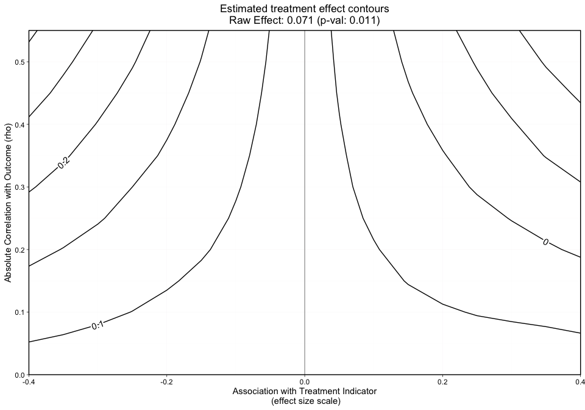
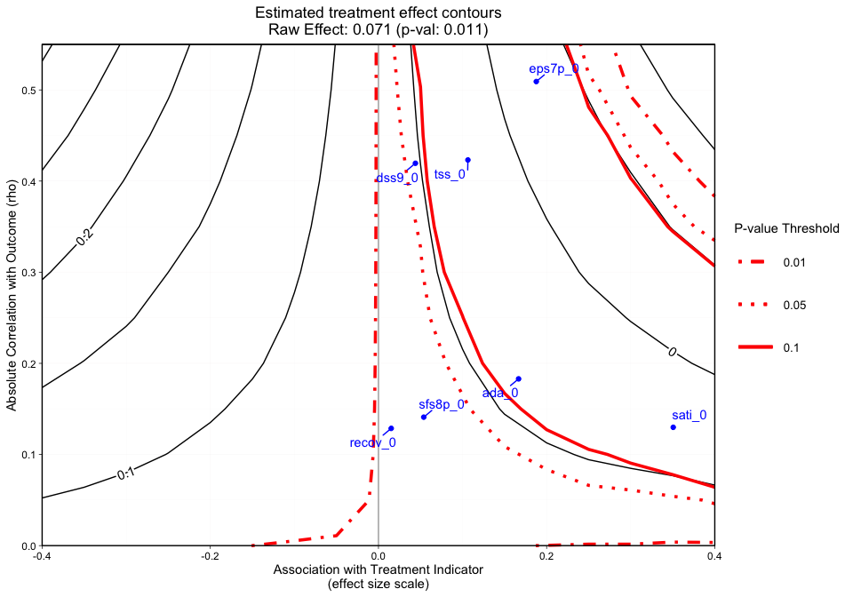
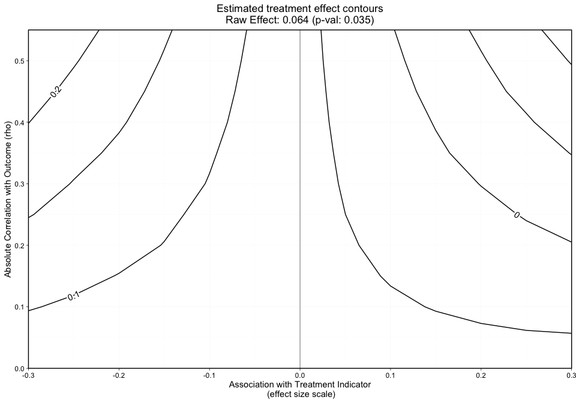
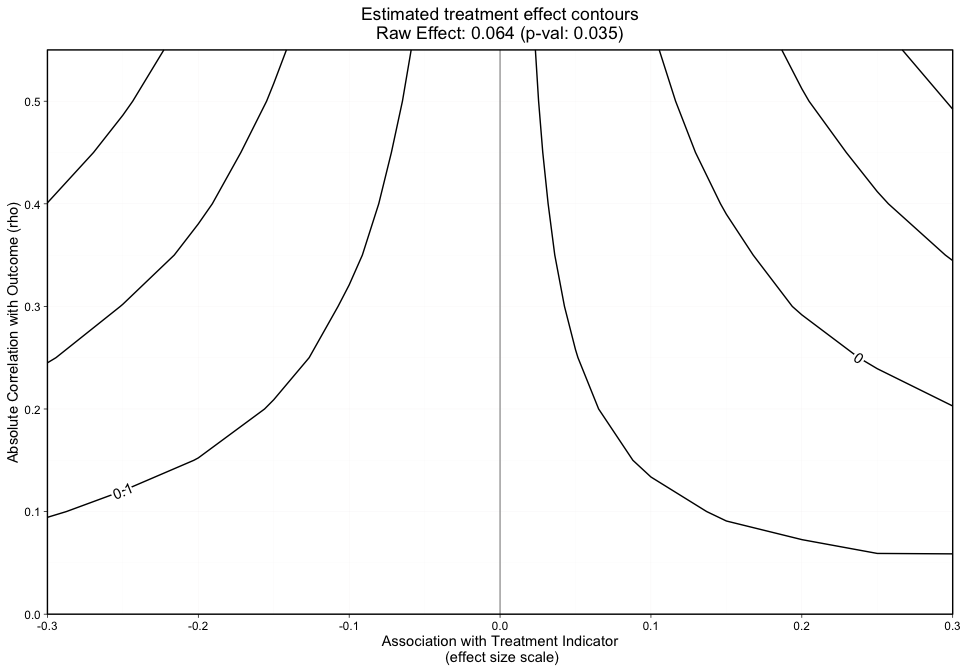
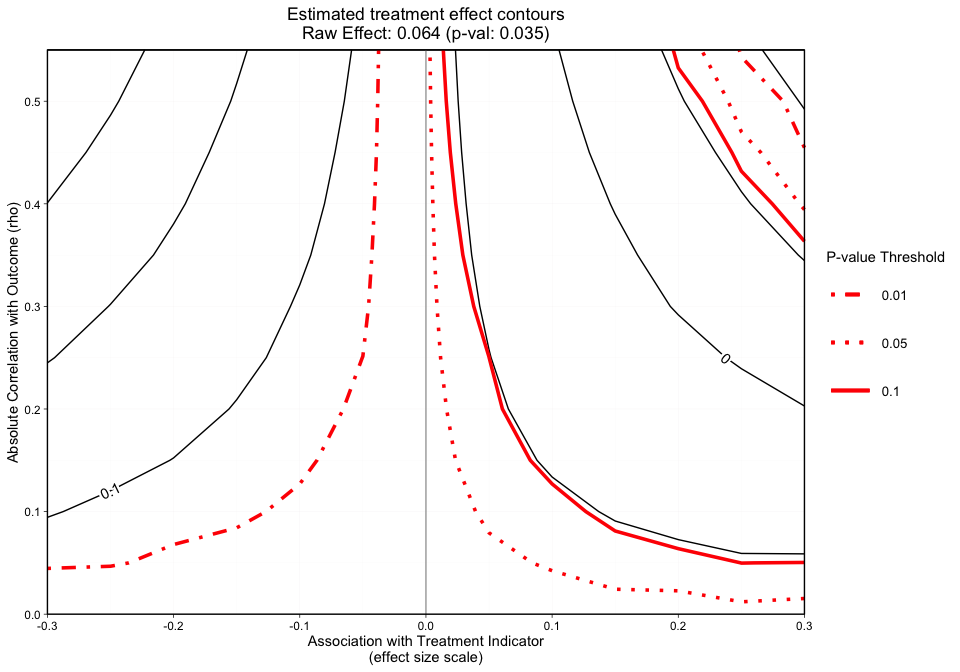
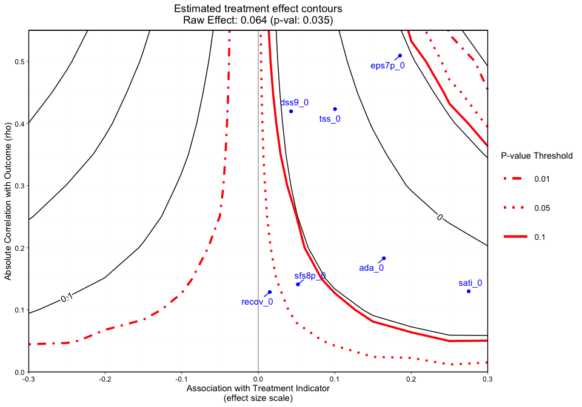

# Introduction

*Note: This is a work in progress.. This document was lasted updated
2020-09-21 13:06:08*

The <ins>O</ins>mitted <ins>V</ins>ariable <ins>T</ins>ool (`OVtool`)
package was designed to assess the sensitivity of research findings to
omitted variables when estimating causal effects using propensity score
(PS) weighting. This package includes graphics and summary results that
will enable a researcher to quantify the impact an omitted variable
would have on their results. Burgette et al. (in preparation) describe
the methodology behind the primary function in this package, `ov_sim()`.
This document presents syntax for the implementation of the `ov_sim()`
function and provides an example of how to interpret the packages’
graphical output.

This package is useful in a wide range of applications where researchers
want to analyze how sensitive their research findings are to unobserved
confounders that were not included in their propensity score and outcome
models. It will estimate the potential impact of the unobserved
counfounders on both the estimated treatment or exposure effects as well
as on the statistical significance of an analysis.

# Example: Synthetic Data

This package is demonstrated using a synthetic data set that was derived
from a large scale observational study on youth in substance use
treatment. More specifically, it contains a subset of measures from the
Global Appraisal of Individual Needs biopsychosocial assessment
instrument (GAIN) (Dennis, Titus et al. 2003) from sites that
adminstered two different types of substance use disorder treatments
(treatment “A” and treatment “B”). The Center for Substance Abuse
Treatment (CSAT) funded the sites that administered these two SUD
treatments. This dataset consists of 4,000 adolescents. The main goal of
this analysis is to understand the effect Treatment A and Treatment B,
indicated by `treat`, have on mental health outcomes and to assess the
potential for an omitted variable to bias the findings. To create our
synthetic data set, we used an R package called
“[synthpop](https://cran.r-project.org/web/packages/synthpop/vignettes/synthpop.pdf)
: Bespoke Creation of Synthetic Data in R”.

In our synthetic dataset, there are 2,000 adolescents in each treatment
group. Within this dataset there are variables on substance use disorder
and mental health outcomes. For this tutorial we are particularly
interested in the mental health outcome, `eps7p_3`, emotional problem
scale (eps) recorded at three months. Higher values of eps indicate more
emotional problems. Substance use researchers are particularly
interested in whether or not treatment A reduces emotional problems more
than treatment B. `eps7p_3` ranges from zero to one, where higher values
of EPS indicate more emotional problems. See (Dennis, 2003) for more
details on this scale.

Past research has indicated there are many influential confounders when
analyzing adolescents’ emotional problems, some included in this
synthetic dataset (Diamond et al.). These variables were measured at
baseline: emotional problem scale (`eps7p_0`), adjusted days abstinent
(any in past 90) (`ada_0`), substance frequency scale (`sfs8p_0`),
substance abuse treatment index (`sati_0`), in recovery (`recov_0`),
traumatic stress scale (`tss_0`), mental health treatment in the past 90
days (`mhtrt_0`), and the depressive symptom scale (`dss9_0`). 

We begin by loading the development version of the package from
[GitHub](https://github.com/). If you haven’t installed the devtools
package, make sure you uncomment and run the first line of the following
code snippet prior to running the second line. *Note: installing OVtool
may require a large number of other package installations if they are
not already installed on your machine. To avoid conflicts, we recommend
you restart your R session after running:*
`devtools::install_github("jpane24/OVtool")`

``` r
# install.packages("devtools")
devtools::install_github("jpane24/OVtool") 
# we recommend restarting your R session after running the previous line of code
# for the first time on your machine.
library(OVtool)
```

We can load the synthetic dataset and make our treatment variable a
binary indicator of 0’s and 1’s:

``` r
data(sud) 
sud$treat = ifelse(sud$treat == "A", 1, 0)
```

The relevant variables in this analysis are:

  - **Treatment indicator** `treat`: indicates treatment type where 1 is
    Treatment “A” and 0 is Treatment “B”

  - **Outcome of interest** `eps7p_3`: emotional problem scale at
    3-months

  - `eps7p_0`: emotional problem scale at baseline

  - `sfs8p_0`: substance frequency scale 8-item version at baseline

  - `sati_0`: substance abuse treatment index at baseline

  - `ada_0`: adjusted days abstinent at baseline

  - `recov_0`: indicates whether the adolescent was in recovery at
    baseline, where 1 is in recovery and 0 is not in recovery

  - `tss_0`: traumatic stress scale at baseline

  - `mhtrt_0`: mental health treatment in the past 90 days at baseline

  - `dss9_0`: depressive symptom scale at baseline

In the next section, we will show how our method works with the average
treatment effect (ATE) using a continuous outcome. **The OVtool will
handle binary outcomes in the near future.**

## Continous Outcome: Average Treatment Effect (ATE)

The `OVtool` can either take a vector of weights estimated using any
method or a ps object produced by `TWANG` (Ridgeway et al., 2020). We
begin walking through the OVtool by estimating weights using `ps()` from
the `TWANG` package prior to running the outcome model using
`outcome_model()` from the `OVtool` package. The `outcome_model`
function calls `svyglm` from the `survey` package in R
([survey](http://cran.fhcrc.org/web/packages/survey/vignettes/survey.pdf))
to produce outcome model results. The chunk of code below demonstrates
how to specify your propensity score model and generate your propensity
score weights using the `TWANG` package.

``` r
## Create Formula
my_formula = as.formula(treat ~ eps7p_0 + sfs8p_0 + sati_0 + ada_0 + recov_0 + 
                          tss_0 + mhtrt_0 + dss9_0)

## Get weights
sud = data.frame(sud)
library(twang)
ps.twang <- ps(my_formula, data = sud, estimand = 'ATE', booster = "gbm",
               stop.method = "ks.max", verbose=F, ks.exact = T)

# Check Balance
bal.table(ps.twang); # summary(ps.twang)
```

    #> $unw
    #>          tx.mn  tx.sd  ct.mn  ct.sd std.eff.sz   stat     p    ks ks.pval
    #> eps7p_0  0.256  0.196  0.219  0.192      0.187  5.937 0.000 0.103   0.000
    #> sfs8p_0 11.253 13.134 10.571 12.162      0.054  1.703 0.089 0.045   0.032
    #> sati_0   8.233 22.128  2.145 10.658      0.345 11.088 0.000 0.121   0.000
    #> ada_0   48.748 33.400 54.236 32.454     -0.166 -5.271 0.000 0.081   0.000
    #> recov_0  0.246  0.431  0.240  0.427      0.015  0.479 0.632 0.006   1.000
    #> tss_0    2.277  3.525  1.924  3.115      0.106  3.365 0.001 0.043   0.050
    #> mhtrt_0  0.290  0.513  0.256  0.484      0.069  2.188 0.029 0.028   0.413
    #> dss9_0   2.750  2.604  2.638  2.492      0.044  1.390 0.165 0.023   0.666
    #> 
    #> $ks.max.ATE
    #>          tx.mn  tx.sd  ct.mn  ct.sd std.eff.sz   stat     p    ks ks.pval
    #> eps7p_0  0.238  0.193  0.232  0.192      0.033  1.015 0.310 0.023   0.697
    #> sfs8p_0 10.830 12.609 10.675 12.324      0.012  0.385 0.700 0.012   0.999
    #> sati_0   5.302 17.852  4.087 15.449      0.069  1.955 0.051 0.024   0.641
    #> ada_0   51.585 32.900 52.540 32.849     -0.029 -0.886 0.376 0.020   0.849
    #> recov_0  0.247  0.431  0.240  0.427      0.017  0.506 0.613 0.007   1.000
    #> tss_0    2.094  3.345  2.024  3.244      0.021  0.656 0.512 0.014   0.990
    #> mhtrt_0  0.271  0.502  0.274  0.500     -0.006 -0.171 0.865 0.004   1.000
    #> dss9_0   2.678  2.551  2.684  2.528     -0.002 -0.075 0.941 0.008   1.000

The output produced by the code snippet above demonstrates that `TWANG`
does a reasonable job of balancing. There are additional diagnostics we
could check to ensure we have good balance but we move on without diving
in further because the purpose of this tutorial is to showcase `OVtool`.
See [Ridgeway et
al.](https://cran.r-project.org/web/packages/twang/vignettes/twang.pdf)
for further information on balance diagnostics. The next step is to
estimate the treatment effect and analyze the sensitivity of those
results using `OVtool`. We first present how a researcher would produce
results for their outcome model. There are two options the researcher
can take to input the relevant information to get their outcome results
using `outcome_model()`.

  - Input a `ps.object` from `TWANG` and a `stop.method`
    (e.g. `"ks.max"`) or
  - Input a vector of `weights`, a data frame containing the `data`
    used, and the column name representing the treatment indicator,
    `treatment`.

The analyst must also provide a column name representing the outcome and
a vector of covariates to be included in the final outcome model.
Recall: `outcome_model()` calls `svyglm()` from the survey package to
run the outcome model.

``` r
# Get weights (not needed if user inserts a ps object in OVTool)
sud$w_twang = ps.twang$w$ks.max.ATE

# Run Models -- first standardize outcome
sud$eps7p_3_std = sud$eps7p_3/sd(sud$eps7p_3) 

# Run outcome model (function in OVtool that calls survey::svyglm)
results = outcome_model(ps_object = NULL,
                        stop.method = NULL, 
                        data = sud,
                        weights = sud$w_twang, 
                        treatment = "treat",
                        outcome = "eps7p_3_std", 
                        model_covariates = c("eps7p_0", "sfs8p_0",
                                             "sati_0", "ada_0",
                                             "recov_0", "tss_0",
                                             "mhtrt_0", "dss9_0"),
                        estimand = "ATE")

summary(results$mod_results)
```

    #> 
    #> Call:
    #> svyglm(formula = formula, design = design_u)
    #> 
    #> Survey design:
    #> survey::svydesign(ids = ~1, weights = ~w_orig, data = data)
    #> 
    #> Coefficients:
    #>               Estimate Std. Error t value Pr(>|t|)    
    #> (Intercept) -0.7079871  0.0649876 -10.894  < 2e-16 ***
    #> treat        0.0785796  0.0275254   2.855  0.00433 ** 
    #> eps7p_0      1.6332282  0.1180704  13.833  < 2e-16 ***
    #> sfs8p_0      0.0023047  0.0020310   1.135  0.25654    
    #> sati_0       0.0017325  0.0012363   1.401  0.16119    
    #> ada_0       -0.0000504  0.0007587  -0.066  0.94704    
    #> recov_0     -0.0693833  0.0314387  -2.207  0.02737 *  
    #> tss_0        0.0312059  0.0068902   4.529 6.10e-06 ***
    #> mhtrt_0      0.2694083  0.0355520   7.578 4.34e-14 ***
    #> dss9_0       0.0489996  0.0078452   6.246 4.66e-10 ***
    #> ---
    #> Signif. codes:  0 '***' 0.001 '**' 0.01 '*' 0.05 '.' 0.1 ' ' 1
    #> 
    #> (Dispersion parameter for gaussian family taken to be 0.6890915)
    #> 
    #> Number of Fisher Scoring iterations: 2

The outcome model results show an adjusted treatment effect estimate
that accounts for confounding from observed covariates between youth in
the two treatment programs (A = 1 and B = 0). From the results, we can
see that the effect size is 0.079 (p = 0.004), whereby youth receiving
treatment A have slightly higher emotional problems at the 3-month
follow-up than youth in treatment program B.

At this stage, researchers should begin to ask themselves if this effect
is real and how sensitive it is. Our tool is used to help answer these
sort of logical next step questions. The next snippet of code presents
the main function in `OVtool`: `ov_sim()`. This function requires
results from `outcome_model()` plus additional parameters including:

  - `weight_covariates`: a vector of column names representing the
    covariates used to produce the analysts propensity score weights
    (these may or may not be the same as the list of covariates used for
    the outcome model)

  - `es_grid`: a vector on an effect size scale representing the
    association between the unobserved confounders (omitted variables)
    and the treatment indicator.

  - `rho_grid`: a vector of absolute correlations to simulate over.
    These correlations represent the absolute correlation between the
    omitted variable and the outcome

  - `n_reps`: the number of repetitions represents the number of times
    an unobserved confounder is simulated at each effect size and rho
    combination. The package defaults to 50. Fifty repetitions should be
    sufficient but the analyst may need to reduce or increase the number
    of repetitions.

The grid, as shown by the x-axis and y-axis in Figure 1 presents the
effect size and rho, respectively. We define the effect size on the
x-axis to show the strength of the relationship between the simulated
unobserved covariate (U) and the treatment group indicator; it is
defined as the standardized mean difference in U for the treatment A and
treatment B groups. Typical rules of thumb for effect sizes (Cohen’s D)
follow such that effect sizes greater than 0.2 would be considered
small, 0.4 would be moderate and 0.6 would be large (Cohen, J., 1995).
We define rho in this setting as the absolute correlation the unobserved
covariate (U) has with the outcome of interest, with larger values
indicating stronger relationships between U and the outcome. Please see
Burgette et al. (in progress) for additional details on the methodology
used by `OVtool`.

``` r
# Run OVtool (with weights (not a ps object))
ovtool_results_twang = ov_sim(model_results=results, 
                              weight_covariates=c("eps7p_0", "sfs8p_0",
                                                  "sati_0", "ada_0",
                                                  "recov_0", "tss_0", 
                                                  "mhtrt_0", "dss9_0"),
                              es_grid = NULL,
                              rho_grid = seq(0, 0.40, by = 0.05), 
                              n_reps = 50,
                              progress = TRUE)
```

    #> Warning in ov_sim(model_results = results, weight_covariates = c("eps7p_0", :
    #> You specified a rho grid whose maximum value is less than the maximum absolute
    #> correlation at least one observed covariate has with the outcome. The rho grid
    #> was automatically expanded to include all weight_covariates specified in the
    #> relevant graphics. If you want the rho grid range to remain from 0 to 0.4 then
    #> you must exclude the following variables from the weight_covariates argument:
    #> eps7p_0, tss_0, dss9_0.

    #> [1] "6% Done!"
    #> [1] "12% Done!"
    #> [1] "18% Done!"
    #> [1] "24% Done!"
    #> [1] "29% Done!"
    #> [1] "35% Done!"
    #> [1] "41% Done!"
    #> [1] "47% Done!"
    #> [1] "53% Done!"
    #> [1] "59% Done!"
    #> [1] "65% Done!"
    #> [1] "71% Done!"
    #> [1] "76% Done!"
    #> [1] "82% Done!"
    #> [1] "88% Done!"
    #> [1] "94% Done!"
    #> [1] "100% Done!"

In our example, `ov_sim` produced a warning saying “You specified a rho
grid whose maximum value is less than the maximum absolute correlation
at least one observed covariate has with the outcome. The rho grid was
automatically expanded to include all weight\_covariates specified in
the relevant graphics. If you want the rho grid range to remain from 0
to 0.4 then you must exclude the following variables from the
weight\_covariates argument: eps7p\_0, tss\_0, dss9\_0.” The grid was
expanded to ensure all `weight_covariates` could be seen on the contour
plot. If the user does not want the grid expanded, they can leave out
the observed covariates used in the propensity score model that have an
absolute correlation with the outcome that is greater than the maximum
rho value the user specifies (`eps_7p_0`, `dss9_0`, and `tss_0`).

The grid values are not required; if es\_grid and/or rho\_grid are set
to `NULL`, the tool will calculate reasonable values to simulate over.
For this tutorial we set `es_grid` to NULL. The tool then iterated over
all observed covariate associations with the treatment indicator on an
effect size scale to derive a reasonable range.

There are a few methodological assumptions that are important for an
analyst to understand.

First, when generating the omitted variable (U), the empirical
cumulative distribution function (CDF) for the outcome within each
treatment is used. When multiple ties are present, the tool handles this
by randomly ranking multiple ties. For example, imagine a scenario where
you have ten observations (shown in rank order) and the first two
observations are 0s. The tool will randomly assign the rank of the two
zeroes and assign the first observation with 0.1 and the second
observation with 0.2 as opposed to assigning the two zeroes a value of
0.2. This process is repeated for each effect size and rho combination
`n_reps` times.

Another key assumption this method draws upon is that the omitted
variable is independent from all observed covariates included in the
propensity score model.

To visualize our results, the `plot.ov` function will produce three
graphics. The first graphic (Figure 1) plots the treatment effect
contours without covariate labels. If the user specifies the parameter
`col` as `"color"`, the contours will overlay a colored heat map. The
second graphic (Figure 2) plots the p-value contours with the column
names submitted to `weight_covariates` plotted by their raw rho and
effect size. The third graphic (Figure 3) plots the treatment effect
contours with the p-value contour overlayed and covariate labels. The
`col` options for Figures 2 and 3 are `"bw"` and `"color"` which produce
a black and white and colored contour graphic, respectively.

``` r
plot.ov(ovtool_results_twang, print_graphic = "1", col = "bw")
```



The y-axis in Figure 1 represents the unobserved confounder’s absolute
correlation with the outcome and the x-axis is the association between
the unobserved confounder and the treatment indicator on an effect size
scale. The black lines represent effect size contours that run along the
grid. The PS weighted treatment effect of Treatment A versus Treatment B
equals 0.079 and is significant with a p-value equal to 0.004. However,
looking at this graphic alone will not give us an idea of how sensitive
the effect is. 

``` r
plot.ov(ovtool_results_twang, print_graphic = "2", col = "color")
```


    #> [1] "NOTE: Covariates with absolute correlation with outcome greater than 0.4: eps7p_0 (Actual:
    0.509), tss_0 (Actual: 0.423), dss9_0 (Actual: 0.420)"

Figure 2 is a different variation of Figure 1, but now adds p-value
contours. This graphic will allow the user to see what treatment effect
on the effect size scale will switch the significance level at critical
p-values (i.e. 0.05). This graphic will now give the user an idea of how
sensitive the effect is. 

``` r
plot.ov(ovtool_results_twang, print_graphic = "3", col = "color")
```



    #> [1] "NOTE: Covariates with absolute correlation with outcome greater than 0.4: eps7p_0 (Actual:
    0.509), tss_0 (Actual: 0.423), dss9_0 (Actual: 0.420)"

Figure 3 adds a final dimension (observed covariate labels) to Figure 2.
Similar to Figures 1 and 2, plotted at the bottom of the figure margin
is the PS weighted treatment effect size (0.079) and associated p-value
of 0.004. The solid black contours represent the effect size (treatment
effect) contour lines and the red lines (sometimes dashed) represent the
p-value threshold. The key on the right side of the graphic shows where
various p-value cutoff lines are, including p = 0.05. The blue points on
the plot represent the observed covariate correlations with the outcome
(y-axis) and effect size associations with the treatment indicator
(x-axis). For instance, `ada_0` and the outcome have approximately a
0.18 absolute correlation with the emotional problem scale at three
months and an absolute association of approximately 0.17 effect size
difference between the two treatment groups (magnitude of its
relationship with the treatment indicator). In this case, not all of the
observed covariate relationships with the outcome and the treatment
indicator are less than the 0.05 p-value threshold so the analyst
potentially has results that are sensitive to an unobserved confounder.
If the blue points all existed in contours greater than the 0.05 p-value
contour, then unobserved confounders with similar associations would
retain the significant effect and allow the user to conclude that the
results are reasonably robust.

*Note: When the outcome model shows a significant effect, for all
observed covariates, regardless of the sign of the association effect
size difference between the two treatment groups, we force the sign of
the magnitude to go with the direction of the significant effect. The
blue points are meant to give the analyst an idea (using observed
covariates as an indicator) of what would cause a change in the
interpretation of their results.*

These results were produced with 50 simulations (`n_reps`) of the
unobserved confounder. If the contours are rigid or the user wants to
add simulations, they can call `add_reps` and specify the number
(`more_reps`) of additional simulations. Once this is completed, a user
can recreate the plots. Example code to add repetitions:

``` r
# If you want to add repetitions, run the following line. You may change more_reps
# ovtool_results_twang = add_reps(OVtool_results = ovtool_results_twang,
#                                 model_results = results,
#                                 more_reps = 3)
#
# Recreate Graphic
# plot.ov(ovtool_results_twang, print_graphic = "1", col = "bw")
```

Finally, we can interpret this graphic by running the summary command on
the ov object:

``` r
summary.ov(object = ovtool_results_twang, model_results = results)
```

    #> [1] "12% Done!"
    #> [1] "25% Done!"
    #> [1] "38% Done!"
    #> [1] "50% Done!"
    #> [1] "62% Done!"
    #> [1] "75% Done!"
    #> [1] "88% Done!"
    #> [1] "100% Done!"
    #> [1] "Recommendation for reporting the sensitivity analyses"
    #> [1] "The sign of the estimated effect is expected to remain consistent when simulated unobserved
    confounders have the same strength of association with the treatment indicator and outcome that are
    seen in the observed confounders. In the most extreme observed case, the estimated effect size is
    reduced by 82 percent."
    #> [1] "Statistical significance at the 0.05 level is expected to be robust to unobserved
    confounders with strengths of associations with the treatment indicator and outcome that are seen
    in 5 of the 8 observed confounders. In the most extreme observed case, the p-value would be
    expected to increase from 0.004 to 0.619. Significance at the 0.05 level would not be expected to
    be preserved for unobserved confounders that have the same strength of association with the
    treatment indicator and outcome as eps7p_0, sati_0, tss_0."

The `OVtool` gives a recommendation on how to report findings regarding
the direction of the treatment effect and statistical significance. An
analyst could take the results produced by `summary.ov()` and plug them
into a manuscript. The sign of the estimated effect is expected to
remain consistent when simulated unobserved confounders have the same
strength of association with the treatment indicator and outcome that
are seen in the observed confounders. In the most extreme observed case,
the estimated effect size is reduced by 83 percent. However, statistical
significance at the 0.05 level is expected to be robust to unobserved
confounders with strengths of associations with the treatment indicator
and outcome that are seen in 5 of the 8 observed confounders. In the
most extreme observed case, the p-value would be expected to increase
from 0.004 to 0.628. Significance at the 0.05 level would not be
expected to be preserved for unobserved confounders that have the same
strength of association with the treatment indicator and outcome as
`eps7p_0`, `sati_0`, `tss_0`.

In the next section, we will show how our method works with the average
treatment effect on the treated (ATT) using a continuous outcome. **As
mentioned above, the OVtool will handle binary outcomes in the near
future.**

# Continous Outcome: Average Treatment Effect on the Treated (ATT)

Perhaps the user is interested in the average treatment effect on the
treated. The tool operates very similarly in the ATT setting. We will
briefly show the steps needed to run the ATT version of the tool for
continuous treatments below. Largely the only difference between ATE and
ATT is the user must specify the correct estimand when (1) generating
their weights and (2) running their outcome model.

``` r
# Propensity score weights:
ps.twang_att <- ps(my_formula, data = sud, estimand = 'ATT', booster = "gbm",
               stop.method = "ks.max", verbose=F, ks.exact = T)
bal.table(ps.twang_att)
```

    #> $unw
    #>          tx.mn  tx.sd  ct.mn  ct.sd std.eff.sz   stat     p    ks ks.pval
    #> eps7p_0  0.256  0.196  0.219  0.192      0.185  5.937 0.000 0.103   0.000
    #> sfs8p_0 11.253 13.134 10.571 12.162      0.052  1.703 0.089 0.045   0.032
    #> sati_0   8.233 22.128  2.145 10.658      0.275 11.088 0.000 0.121   0.000
    #> ada_0   48.748 33.400 54.236 32.454     -0.164 -5.271 0.000 0.081   0.000
    #> recov_0  0.246  0.431  0.240  0.427      0.015  0.479 0.632 0.006   1.000
    #> tss_0    2.277  3.525  1.924  3.115      0.100  3.365 0.001 0.043   0.050
    #> mhtrt_0  0.290  0.513  0.256  0.484      0.067  2.188 0.029 0.028   0.413
    #> dss9_0   2.750  2.604  2.638  2.492      0.043  1.390 0.165 0.023   0.666
    #> 
    #> $ks.max.ATT
    #>          tx.mn  tx.sd  ct.mn  ct.sd std.eff.sz   stat     p    ks ks.pval
    #> eps7p_0  0.256  0.196  0.249  0.193      0.034  1.024 0.306 0.026   0.561
    #> sfs8p_0 11.253 13.134 11.016 12.677      0.018  0.544 0.587 0.020   0.866
    #> sati_0   8.233 22.128  6.376 19.312      0.084  1.939 0.053 0.035   0.214
    #> ada_0   48.748 33.400 50.291 33.318     -0.046 -1.349 0.177 0.028   0.478
    #> recov_0  0.246  0.431  0.229  0.420      0.039  1.207 0.227 0.017   0.953
    #> tss_0    2.277  3.525  2.263  3.432      0.004  0.114 0.909 0.015   0.980
    #> mhtrt_0  0.290  0.513  0.307  0.521     -0.032 -0.909 0.363 0.016   0.978
    #> dss9_0   2.750  2.604  2.832  2.589     -0.031 -0.912 0.362 0.021   0.811

Notice that the only difference here is we use `estimand = ATT` to
estimate the propensity score weights using TWANG. Again, we have
reasonable balance. In fact, all of our standardized effect size
differences are less than 0.1.

``` r
results_att = outcome_model(ps_object = ps.twang_att,
                            stop.method = "ks.max",
                            data = sud,
                            weights = NULL, # weights to NULL
                            treatment = "treat",
                            outcome = "eps7p_3_std",
                            model_covariates = c("eps7p_0", "sfs8p_0",
                                                 "sati_0", "ada_0",
                                                 "recov_0", "tss_0",
                                                 "mhtrt_0", "dss9_0"),
                            estimand = "ATT")
summary(results_att$mod_results)
```

    #> 
    #> Call:
    #> svyglm(formula = formula, design = design_u)
    #> 
    #> Survey design:
    #> survey::svydesign(ids = ~1, weights = ~w_orig, data = data)
    #> 
    #> Coefficients:
    #>               Estimate Std. Error t value Pr(>|t|)    
    #> (Intercept) -0.7196504  0.0666856 -10.792  < 2e-16 ***
    #> treat        0.0669815  0.0298823   2.242   0.0250 *  
    #> eps7p_0      1.6224090  0.1216548  13.336  < 2e-16 ***
    #> sfs8p_0      0.0028975  0.0021227   1.365   0.1723    
    #> sati_0       0.0020634  0.0012422   1.661   0.0968 .  
    #> ada_0        0.0002657  0.0007851   0.338   0.7351    
    #> recov_0     -0.0756167  0.0332064  -2.277   0.0228 *  
    #> tss_0        0.0338415  0.0072709   4.654 3.36e-06 ***
    #> mhtrt_0      0.2549506  0.0360198   7.078 1.72e-12 ***
    #> dss9_0       0.0489526  0.0080671   6.068 1.41e-09 ***
    #> ---
    #> Signif. codes:  0 '***' 0.001 '**' 0.01 '*' 0.05 '.' 0.1 ' ' 1
    #> 
    #> (Dispersion parameter for gaussian family taken to be 0.7221675)
    #> 
    #> Number of Fisher Scoring iterations: 2

Again, the only difference in the call to the outcome\_model function is
specifying the correct `estimand`. Under the ATT setting, our effect
size is 0.07 with a p-value of 0.025. We now want to understand how
sensitive our result is to unobserved confounders.

Below we will run the `ov_sim` function; we notice that in our call to
`ov_sim` the parameters remain the same. The `estimand` parameter is
stored in `results_att` and carried forward throughout the remainder of
the analysis.

``` r
ovtool_results_twang_att = ov_sim(model_results=results_att, 
                                  weight_covariates=c("eps7p_0", "sfs8p_0",
                                                      "sati_0", "ada_0",
                                                      "recov_0", "tss_0", 
                                                      "mhtrt_0", "dss9_0"),
                                  es_grid = NULL,
                                  rho_grid = seq(0, 0.40, by = 0.05), 
                                  n_reps = 50,
                                  progress = TRUE)
```

    #> Warning in ov_sim(model_results = results_att, weight_covariates =
    #> c("eps7p_0", : You specified a rho grid whose maximum value is less than
    #> the maximum absolute correlation at least one observed covariate has
    #> with the outcome. The rho grid was automatically expanded to include all
    #> weight_covariates specified in the relevant graphics. If you want the rho grid
    #> range to remain from 0 to 0.4 then you must exclude the following variables from
    #> the weight_covariates argument: eps7p_0, tss_0, dss9_0.

    #> [1] "8% Done!"
    #> [1] "15% Done!"
    #> [1] "23% Done!"
    #> [1] "31% Done!"
    #> [1] "38% Done!"
    #> [1] "46% Done!"
    #> [1] "54% Done!"
    #> [1] "62% Done!"
    #> [1] "69% Done!"
    #> [1] "77% Done!"
    #> [1] "85% Done!"
    #> [1] "92% Done!"
    #> [1] "100% Done!"

We have found that the number of repetitions needed in the ATT setting
is greater than in the ATE setting. Once we observe our graphical
results, if the contours do not look smooth, we recommend calling
`OVtool::add_reps` and specifying `more_reps` to the number of
additional simulations of the unobserved confounder you desire.

``` r
plot.ov(ovtool_results_twang_att, print_graphic = "1", col = "bw")
```



The contours shown in Figure 4 are relatively smooth but we would like
to smooth them out if possible by simulating our unobserved confounder
an additional 200 times. The user can do this by running the following
lines of code.

``` r
# If you want to add repetitions, run the following line. You may change more_reps
ovtool_results_twang_att = add_reps(OVtool_results = ovtool_results_twang_att,
                                    model_results = results_att,
                                    more_reps = 200)
```

    #> [1] "8% Done!"
    #> [1] "15% Done!"
    #> [1] "23% Done!"
    #> [1] "31% Done!"
    #> [1] "38% Done!"
    #> [1] "46% Done!"
    #> [1] "54% Done!"
    #> [1] "62% Done!"
    #> [1] "69% Done!"
    #> [1] "77% Done!"
    #> [1] "85% Done!"
    #> [1] "92% Done!"
    #> [1] "100% Done!"

``` r
plot.ov(ovtool_results_twang_att, print_graphic = "1", col = "bw")
```



``` r
plot.ov(ovtool_results_twang_att, print_graphic = "2", col = "color")
```



    #> [1] "NOTE: Covariates with absolute correlation with outcome greater than 0.3: eps7p_0 (Actual: 0.509), tss_0 (Actual: 0.423), dss9_0 (Actual: 0.420)"

``` r
plot.ov(ovtool_results_twang_att, print_graphic = "3", col = "color")
```



    #> [1] "NOTE: Covariates with absolute correlation with outcome greater than 0.3: eps7p_0 (Actual: 0.509), tss_0 (Actual: 0.423), dss9_0 (Actual: 0.420)"

Finally, we will run the `summary.ov` function to get the tool’s
recommendations.

``` r
summary.ov(object = ovtool_results_twang_att, model_results = results_att)
```

    #> [1] "12% Done!"
    #> [1] "25% Done!"
    #> [1] "38% Done!"
    #> [1] "50% Done!"
    #> [1] "62% Done!"
    #> [1] "75% Done!"
    #> [1] "88% Done!"
    #> [1] "100% Done!"
    #> [1] "Recommendation for reporting the sensitivity analyses"
    #> [1] "The sign of the estimated effect is expected to remain consistent when simulated unobserved confounders have the same strength of association with the treatment indicator and outcome that are seen in the observed confounders. In the most extreme observed case, the estimated effect size is reduced by 96 percent."
    #> [1] "Statistical significance at the 0.05 level is expected to be robust to unobserved confounders with strengths of associations with the treatment indicator and outcome that are seen in 1 of the 8 observed confounders. In the most extreme observed case, the p-value would be expected to increase from 0.025 to 0.953. Significance at the 0.05 level would not be expected to be preserved for unobserved confounders that have the same strength of association with the treatment indicator and outcome as eps7p_0, sfs8p_0, sati_0, ada_0, tss_0, mhtrt_0, dss9_0."

# Conclusion

There is continuously a call for work on assessing the sensitivity of
research findings. To our knowledge, this is a novel approach to
assessing the sensitivity of research findings to omitted variables when
estimating causal effects using PS weighting. Development of user
friendly software tools are critical for advancing research. We hope
that users will use our tool when they are trying to analyze how
sensitive their results are to omitted variables when estimating causal
effects using ps methods.

# Acknowledgements

The devlopment of this tutorial was supported by funding from grant
R01DA045049 (PIs: Griffin/McCaffrey) from the National Institute on Drug
Abuse. It was also supported by the Center for Substance Abuse Treatment
(CSAT), Substance Abuse and Mental Health Services Administration
(SAMHA). The authors thank these agencies, grantees, and their
participants for agreeing to share their data to support creation of the
synthetic dataset used in this analysis. This tutorial uses a synthetic
dataset of youth receiving two unidentified treatments from the GAIN;
running on the true dataset will produce different results.

# References

*Will update to link with text*

Cohen, J. (1995). The earth is round (p \< .05): Rejoinder. American
Psychologist, 50, 1103.

Diamond, G., Godley, S. H., Liddle, H. A., Sampl, S., Webb, C., Tims, F.
M., & Meyers, R. (2002). Five outpatient treatment models for adolescent
marijuana use: a description of the Cannabis Youth Treatment
Interventions. Addiction, 97, 70-83.

Lumley, T (2020). “survey: analysis of complex survey samples.” R
package version 4.0.

McCaffrey, D. F., Ridgeway, G., and Morral, A. R. (2004). Propensity
score estimation with boosted regression for evaluating causal effects
in observational studies. Psychological methods 9, 403.

Ridgeway, G., McCaffrey, D., Morral, A., Burgette, L., and Griffin, B.
A. (2020). Toolkit for Weighting and Analysis of Nonequivalent Groups: A
tutorial for the twang package. Santa Monica, CA: RAND Corporation.
